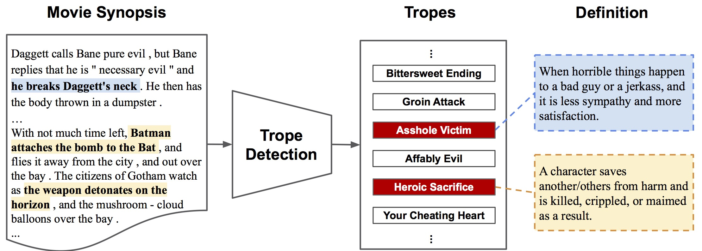

# TiMoS (Trope in Movie Synopses)

[Situation and Behavior Understanding by Trope Detection on Films](https://arxiv.org/abs/2101.07632), TheWebConf (WWW) 2021

Chen-Hsi Chang*, Hung-Ting Su*, Juiheng Hsu, Yu-Siang Wang, Yu-Cheng Chang, Zhe Yu Liu, Ya-Liang Chang, Wen-Feng Cheng, Ke-Jyun Wang and Winston H. Hsu 

(*: Equal contribution)


# What is a trope?

A [trope](https://tvtropes.org/pmwiki/pmwiki.php/Main/Trope) is a storytelling device, or a shortcut, frequently used in creative productions such as novels, TV series and movies to describe situations that storytellers can reasonably assume the audience will recognize. Beyond actions, events, and activities, they are the tools that the art creators use toexpress ideas to the audience without needing to spell out all the details.

For example, [Heroic Sacrifice](https://tvtropes.org/pmwiki/pmwiki.php/Main/HeroicSacrifice) is when *a character saves another/others from harm and is killed, crippled, or maimed as a result.* [Asshole Victim](https://tvtropes.org/pmwiki/pmwiki.php/Main/AssholeVictim) is *normally when something bad happens to an individual you feel some degree of pity for them.*

# Trope detection

The trope detection task is formulated as a multi-label classification problem. Given a film, the model is asked to predict the tropes’ appearance in the film. More specifically, the input instance is a film synopsis, and the output is a binary vector with size |𝑇|, where 𝑇 = {𝑡1, 𝑡2, ...} denotes the set of all the tropes.


# TiMoS dataset

The TiMoS dataset contains (1) 5623 movie synopses, (2) 95 tropes along with their definitions and human labeled categories, and (3) trope appearances in each film. The movie synopses are collected from the [MPST](https://www.aclweb.org/anthology/L18-1274.pdf) dataset and the trope appearances are obtained from [TVTropes](https://tvtropes.org).

# Training


# Testing


# Citation
```
@inproceedings{
chang2021timos,
title={Situation and Behavior Understanding by Trope Detection on Films},
author={Chen-Hsi Chang and Hung-Ting Su and Juiheng Hsu and Yu-Siang Wang and Yu-Cheng Chang and Zhe Yu Liu and Ya-Liang Chang and Wen-Feng Cheng and Ke-Jyun Wang and Winston H. Hsu},
booktitle={WWW},
year={2021},
}
```

# Contact
Hung-Ting Su, htsu@cmlab.csie.ntu.edu.tw
